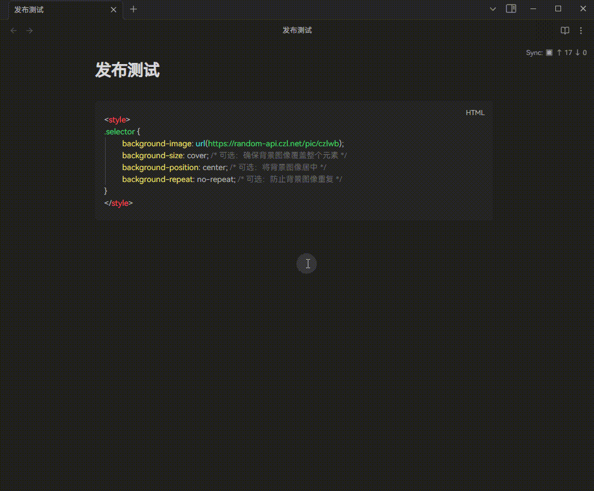
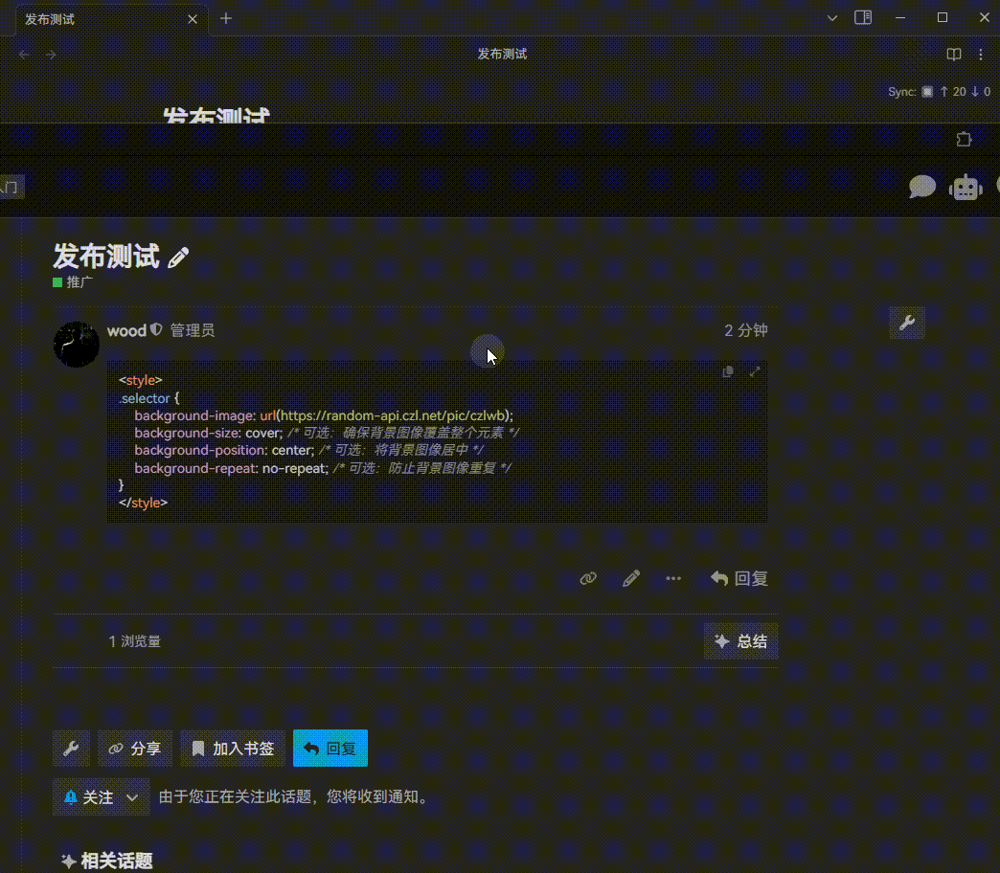

# Publish to Discourse

## 配置User Api key

下载插件, 在设置页面添加"论坛地址"后配置.

## 发布帖子

在文档页面的右上角, 展开菜单, 选择"发布到discourse", 选择类别即可.

在发布帖子成功后, 会在笔记属性里添加一个"discourse_post_id"属性, 用于更新帖子.

## 更新帖子

在文档页面的右上角, 展开菜单, 选择"发布到discourse", 点击更新即可.

> 更新的前提是帖子本身是通过obsidian发布的.

## 在discourse中打开

在笔记页面, 使用(Ctrl/Cmd + P)打开discourse的帖子.

## 多论坛功能 (Multi-Forum Support)

插件支持配置多个论坛预设，可以在发布时选择目标论坛。这个功能特别适合需要同时向不同论坛发布内容的用户。

### 启用多论坛功能

1. 在插件设置中切换到"多论坛管理"选项卡
2. 开启"启用多论坛功能"开关
3. 点击"添加论坛预设"来配置不同的论坛

### 配置论坛预设

每个论坛预设包含：
- **论坛名称**: 用于识别的友好名称
- **论坛地址**: Discourse论坛的完整URL
- **API密钥**: 该论坛的User-API-Key

### 使用多论坛功能

启用多论坛功能后，在发布文章时会首先弹出论坛选择界面，让你选择要发布到哪个论坛。选择后，插件会自动切换到对应的论坛配置进行发布。

### 兼容性说明

- 多论坛功能是可选的，不影响现有的单论坛使用流程
- 如果不启用多论坛功能，插件会继续使用原有的配置方式
- 已有的配置和发布的文章不会受到影响

---

## 赞助 / Sponsorship

如果这个插件对你有帮助, 欢迎请我喝杯咖啡。当然, 只要使用就是对我最大的支持。

If this plugin has been helpful to you, feel free to buy me a coffee. Of course, using it is the greatest support you can give me.

| 微信赞赏 | 支付宝 |
|:---:|:---:|
|  |  |

国际支付 / International Payment:

- Wise (Card / Apple Pay / Google Pay / Bank Transfer):  
  https://wise.com/pay/business/czlltd
- Stripe (Credit Card / Apple Pay / Google Pay):  
  https://donate.stripe.com/6oUeVefrQcNzg2J1cdco000

